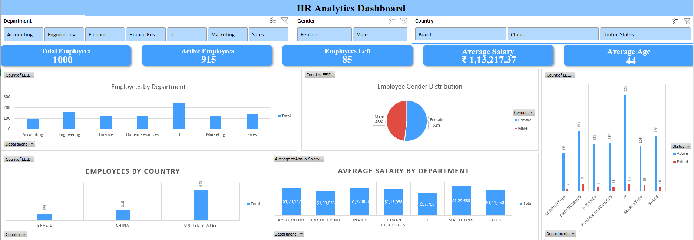

# HR-Analytics-Dashboard (Interactive Dashboard Creation Using MS Excel)

## Project Objective
The objective of this project is to analyze employee data and build an interactive HR Analytics Dashboard using Microsoft Excel.
This dashboard helps HR managers and business leaders understand employee distribution, workforce demographics, salary trends, and attrition patterns. The insights generated from the dashboard can support better workforce planning, employee retention strategies, and organizational decision-making.

## Dataset Used
- <a href="https://github.com/imsouravsaha/HR-Analytics-Dashboard/blob/main/HR-Analytics-Dashboard.xlsx">Dataset</a>

Employee dataset containing the following information:
Employee ID,
Employee Name,
Department,
Job Title,
Gender,
Ethnicity,
Age,
Hire Date,
Annual Salary,
Bonus Percentage,
Country,
City,
Exit Date,

## Questions (KPIs)
The dashboard answers the following business questions:
- What is the total number of employees in the organization?
- How many employees are currently active?
- How many employees have left the company?
- What is the average employee salary?
- What is the average employee age?
- How are employees distributed across departments?
- What is the gender distribution in the organization?
- Which countries have the highest number of employees?
- Which department has the highest average salary?
- Which departments have the highest employee attrition?

## Dashboard Interaction 
<a href="https://github.com/imsouravsaha/HR-Analytics-Dashboard/blob/main/dashboard-preview.png">View Dashboard</a>

# Process
## The following steps were performed to build the dashboard:
- Verified the dataset for missing values and inconsistencies.
- Cleaned and organized the data to ensure correct data types and formats.
- Converted the dataset into an Excel table for easier analysis.
- Created Pivot Tables to analyze employee data.
- Built Pivot Charts to visualize insights.
- Designed KPI metrics such as total employees and average salary.
- Added Slicers (Department, Gender, Country) to enable interactive filtering.
- Combined all visualizations into a single interactive dashboard.

# Dashboard

# Project Insights
## Key insights derived from the dashboard:
- The organization has 1000 total employees, with 915 active employees.
- 85 employees have left the company, indicating measurable attrition.
- Employee distribution varies significantly across different departments.
- Workforce demographics show a balanced gender distribution.
- Some departments offer higher average salaries compared to others.
- Employees are distributed across multiple countries including the United States, China, and Brazil.

# Final Conclusion
The HR Analytics Dashboard provides valuable insights into workforce structure and employee trends.
## Organizations can use these insights to:
- Monitor employee attrition
- Evaluate departmental workforce distribution
- Understand salary trends
- Support data-driven HR decision making
- Interactive dashboards like this enable HR teams to quickly analyze workforce data and improve organizational planning.

# Author
## SOURAV SAHA
Entry-Lavel Data Analyst passionate about data analysis and visualization.

If you found this project useful
⭐ Feel free to star this repository and share feedback!
